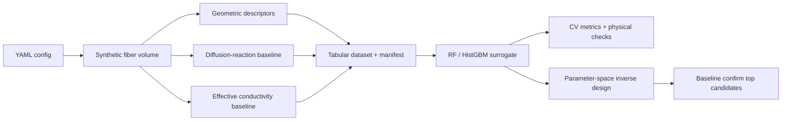

# tps-microstructure-surrogate

Reduced-order **microscale** study of synthetic FiberForm-*like* porous carbon-fiber materials: generate voxel microstructures, run a simplified oxygen diffusion–reaction baseline and a steady conduction baseline, then train a **tabular** physics-guided surrogate (Random Forest / HistGBM).

This is **not** a spacecraft reentry simulation, **not** hypersonic CFD, and **not** a flight-certification tool.

## Disclaimer

Educational research prototype. Material properties, diffusivities, reaction rates, and boundary values in the YAML configs are **illustrative or configurable** unless a cited source appears in [`docs/references.md`](docs/references.md).

**The surrogate is validated only against this project's own numerical baseline, not against laboratory data and not against PuMA.** Agreement with the baseline shows that the surrogate learned the simplified numerical model — **not** that the simplified model matches physical reality. Read [`docs/model_assumptions.md`](docs/model_assumptions.md) before quoting any number.

NASA’s [PuMA](https://github.com/nasa/puma) software, the Ferguson et al. publications, and the NASA SC22 microscale TPS overview are **attribution / background**. They are not endorsements and this repository does not implement those production models.

## Research question

Can a physics-guided machine-learning surrogate predict oxidation penetration depth and through-thickness effective thermal conductivity of FiberForm-like porous carbon-fiber microstructures with low error and substantially lower inference time than a numerical diffusion–reaction baseline?

## Hypothesis

A physics-guided ML surrogate trained on numerical simulations of controlled synthetic fiber microstructures can predict those two quantities within a pre-registered error threshold while evaluating unseen designs much faster than re-solving the numerical model.

## Pipeline



## Repository layout

```
tps-microstructure-surrogate/
├── configs/          # default.yaml, small_demo.yaml, experiment_registry.yaml
├── docs/             # research plan, assumptions, methods, verification
├── scripts/          # CLI entry points
├── src/tps_surrogate/
├── tests/            # including analytical verification
├── data/             # git-ignored generated arrays
└── outputs/          # git-ignored figures, models, reports
```

## Install (macOS / Linux / Windows)

Python **3.11+**. CPU only. From the repository root:

```bash
python3.11 -m venv .venv
# macOS/Linux
source .venv/bin/activate
# Windows (cmd)
# .venv\Scripts\activate
python -m pip install --upgrade pip
pip install -r requirements-lock.txt
pip install -e .
```

If `python3.11` is not on your PATH, `python3.12` works for local runs; CI uses 3.11.

Optional extras (not required):

```bash
pip install -e ".[torch]"   # reserved for a future neural-operator interface
pip install -e ".[puma]"    # often painful on Windows; see docs/future_puma_integration.md
```

## CPU-only quick start

```bash
python scripts/run_demo.py --config configs/small_demo.yaml --overwrite
```

Target: finish in under ~3 minutes on a laptop CPU. Artifacts land in `outputs/small_demo/` (`processed/dataset.csv`, `models/`, `figures/`, `reports/summary.md`).

Equivalent Makefile:

```bash
make install
make demo
make test
make lint
```

## Main commands

```bash
python scripts/generate_dataset.py --config configs/default.yaml
python scripts/train_surrogate.py --config configs/default.yaml
python scripts/evaluate_model.py --config configs/default.yaml
python scripts/optimize_microstructure.py --config configs/default.yaml
python scripts/run_all.py --config configs/default.yaml --overwrite
```

Shared flags: `--seed`, `--output-dir`, `--overwrite`. Always launch from the **repository root**.

## Tests and CI

```bash
python -m pytest -m "not slow"          # includes analytical verification
python -m pytest tests/test_convergence.py -m slow
ruff check src scripts tests
python -m compileall src scripts
```

GitHub Actions (`.github/workflows/ci.yml`) installs the lockfile, runs Ruff, and runs pytest except the slow refinement study, on `ubuntu-latest` / Python 3.11.

## Expected outputs

| path | content |
|---|---|
| `outputs/<name>/processed/dataset.csv` | features + targets |
| `outputs/<name>/processed/manifest.json` | seeds, git hash, failures |
| `outputs/<name>/models/surrogate_*.joblib` | trained RF bundle |
| `outputs/<name>/figures/*.png` | parity, residuals, slices, Pareto |
| `outputs/<name>/reports/summary.md` | metrics with CV mean ± std |
| `outputs/<name>/tables/optimization_candidates.csv` | inverse-design table |

Large arrays and models are git-ignored. Re-create them from the lockfile and the recorded seed.

## Reproducibility

See [`docs/reproducibility.md`](docs/reproducibility.md). Pin versions with `requirements-lock.txt`. Quote the git commit stored in the dataset manifest whenever you discuss a number.

## Optional PuMA

Not needed to run or test this repository. If you want to compare descriptors later, follow [`docs/future_puma_integration.md`](docs/future_puma_integration.md) and verify the `pumapy` API for **your** version.

## Customize an experiment

Edit these first:

1. `configs/small_demo.yaml` or `configs/default.yaml` — domain, sample count, property ranges, CV folds.
2. `docs/research_plan.md` — pre-registered success thresholds (before you look at results).
3. `src/tps_surrogate/constants.py` — only if you add a **cited** default.

## Collaboration

- Feature branches and pull requests; no direct unreviewed pushes of results to `main`.
- Issues should include config name + git hash from `manifest.json`.
- Never commit credentials, `.env` files, or large raw volumes.

## Attribution

- NASA PuMA: [https://github.com/nasa/puma](https://github.com/nasa/puma)
- PuMA docs: [https://puma-nasa.readthedocs.io/](https://puma-nasa.readthedocs.io/)
- NASA SC22 microscale TPS overview: [https://www.nas.nasa.gov/SC22/research/project27.html](https://www.nas.nasa.gov/SC22/research/project27.html)
- Ferguson et al., “PuMA: The Porous Microstructure Analysis software,” *SoftwareX*, 2018
- Ferguson et al., “Modeling the oxidation of low-density carbon fiber material based on micro-tomography,” *Carbon*, 2016

Full citation list: [`docs/references.md`](docs/references.md). Those works are background. **Project-generated numbers in `outputs/` are not NASA results.**

## License

MIT. See `LICENSE` and `CITATION.cff`.
